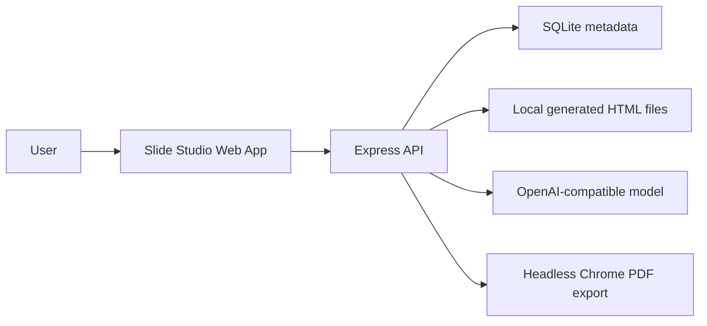

# Slide Studio

Slide Studio is a portfolio MVP for an AI-powered presentation artifact workspace. It turns a prompt, artifact type, and visual template into a polished HTML-first presentation with interactive walkthroughs, data views, process diagrams, chat edits, annotations, undo, versions, fullscreen presentation, and export.

## Demo

- App: `http://localhost:5173`
- Product case page: `http://localhost:5173/product.html`
- Demo account: `demo@slidestudio.local`
- Demo password: `demo1234`

The app seeds the demo account and two sample projects on startup unless `SEED_DEMO=false`.

## What It Shows

- Prompt-to-HTML presentation artifact generation using an OpenAI-compatible API
- Artifact type selection for product walkthroughs, startup pitches, AI project showcases, technical proposals, data stories, and sales narratives
- Template selection and fixed 1920x1080 presentation output
- Chat-based deck editing
- Annotation-based targeted edits
- Undo and deck version history
- Fullscreen presentation with keyboard navigation
- HTML download and PDF export
- Email/password auth
- SQLite persistence for users, sessions, projects, versions, messages, comments, and template choices
- Local file storage for generated deck HTML

## Local Setup

```bash
npm install
npm run dev
```

Open `http://127.0.0.1:5173`.

To generate new decks, configure the model once on the server with an OpenAI-compatible key, then users can log in and generate decks immediately.

## Environment

For local development, copy `.env.example` to `.env` and edit the model settings there. The app loads `.env` automatically on startup, and `.env` is ignored by git so your key stays local.

For deployment, copy the same values from `.env.example` into your deployment provider's environment variable UI.

Important variables:

- `SLIDE_STUDIO_DATA_DIR`: directory for SQLite and generated files
- `OPENAI_API_KEY`: server-side OpenAI-compatible API key used for generation and edits
- `OPENAI_BASE_URL`: defaults to `https://api.openai.com/v1`
- `OPENAI_MODEL`: defaults to `gpt-4.1`
- `AI_API_KEY`, `AI_BASE_URL`, `AI_MODEL`: optional aliases if you do not want OpenAI-prefixed variable names
- `APP_BASE_URL`: public app URL used to build email verification links
- `SMTP_HOST`, `SMTP_PORT`, `SMTP_USER`, `SMTP_PASS`, `EMAIL_FROM`: optional SMTP settings for real verification emails. For Gmail, use `SMTP_HOST=smtp.gmail.com`, `SMTP_PORT=465`, `SMTP_SECURE=true`, and a Gmail App Password as `SMTP_PASS`.
- `GUEST_COOKIE_DAILY_LIMIT`, `GUEST_DEVICE_DAILY_LIMIT`, `GUEST_BROWSER_DAILY_LIMIT`, `GUEST_IP_DAILY_LIMIT`: guest trial guardrails, defaulting to 3/3/3/5
- `SIGNUP_VERIFIED_CREDITS`: credits added after email verification, defaulting to 10
- `FREE_DAILY_BUDGET_CENTS` and `GENERATION_COST_CENTS`: site-wide free usage budget guardrail, defaulting to 500 and 25
- `BASIC_TRIAL_TEMPLATE_IDS`: comma-separated template IDs available during guest trial
- `DEMO_EMAIL`: defaults to `demo@slidestudio.local`
- `DEMO_PASSWORD`: defaults to `demo1234`
- `CHROME_PATH`: Chrome/Chromium executable for PDF export

## Architecture



SQLite stores structured product data. Local file storage stores generated HTML and export artifacts. This is intentionally simple for a portfolio MVP and can later move to Postgres plus object storage.

## Deploy

The recommended portfolio deployment is Render or Railway using the included `Dockerfile`.

1. Create a new web service from this repository.
2. Use Docker deploy.
3. Add a persistent disk mounted at `/var/data`.
4. Set `SLIDE_STUDIO_DATA_DIR=/var/data`.
5. Set `NODE_ENV=production`.
6. Set `OPENAI_API_KEY` or `AI_API_KEY` so users can generate decks out of the box.
7. Deploy and open `/product.html` first for the portfolio explanation.

See [docs/deployment.md](docs/deployment.md) for provider-specific notes.

## Portfolio Materials

- [Product case study](docs/case-study.md)
- [Deployment guide](docs/deployment.md)
- [3-minute demo script](docs/demo-script.md)

## Verification

```bash
npm test
npm run build
```

## MVP Tradeoffs

- SQLite is used for speed and simplicity; Postgres is the likely production database.
- Generated HTML is stored locally; object storage is the likely production file store.
- Model API keys are configured server-side through environment variables; a production version should use a managed secret store and usage controls.
- The demo account is seeded for reviewer convenience and should be disabled or hardened for a public launch.
