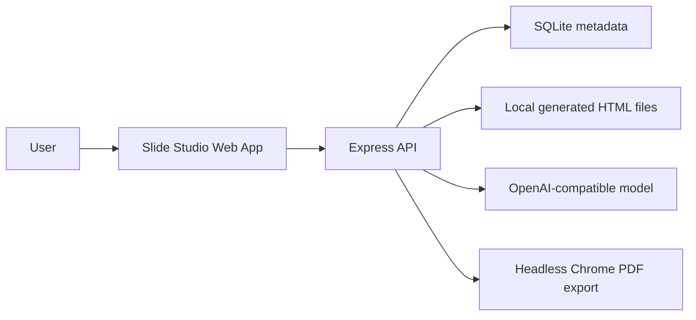

# Slide Studio

Slide Studio is a portfolio MVP for an AI-powered slide workspace. It turns a prompt and a visual template into a polished HTML slide deck, then lets users keep editing the deck through chat, annotations, undo, versions, fullscreen presentation, and export.

## Demo

- App: `http://localhost:5173`
- Product case page: `http://localhost:5173/product.html`
- Demo account: `demo@slidestudio.local`
- Demo password: `demo1234`

The app seeds the demo account and two sample projects on startup unless `SEED_DEMO=false`.

## What It Shows

- Prompt-to-HTML slide generation using an OpenAI-compatible API
- Template selection and fixed 1920x1080 presentation output
- Chat-based deck editing
- Annotation-based targeted edits
- Undo and deck version history
- Fullscreen presentation with keyboard navigation
- HTML download and PDF export
- Email/password auth
- SQLite persistence for users, sessions, projects, versions, model config, messages, comments, and template choices
- Local file storage for generated deck HTML

## Local Setup

```bash
npm install
npm run dev
```

Open `http://127.0.0.1:5173`.

To generate new decks, log in, open model settings, and save an OpenAI-compatible API key. The seeded demo projects can be viewed without an API key.

## Environment

Copy `.env.example` into your deployment provider's environment variable UI. The app does not require a local `.env` file.

Important variables:

- `SLIDE_STUDIO_DATA_DIR`: directory for SQLite and generated files
- `OPENAI_API_KEY`: optional default key for the seeded demo account
- `OPENAI_BASE_URL`: defaults to `https://api.openai.com/v1`
- `OPENAI_MODEL`: defaults to `gpt-4.1`
- `DEMO_EMAIL`: defaults to `demo@slidestudio.local`
- `DEMO_PASSWORD`: defaults to `demo1234`
- `CHROME_PATH`: Chrome/Chromium executable for PDF export

## Architecture



SQLite stores structured product data. Local file storage stores generated HTML and export artifacts. This is intentionally simple for a portfolio MVP and can later move to Postgres plus object storage.

## Deploy

The recommended portfolio deployment is Render or Railway using the included `Dockerfile`.

1. Create a new web service from this repository.
2. Use Docker deploy.
3. Add a persistent disk mounted at `/var/data`.
4. Set `SLIDE_STUDIO_DATA_DIR=/var/data`.
5. Set `NODE_ENV=production`.
6. Optionally set `OPENAI_API_KEY`.
7. Deploy and open `/product.html` first for the portfolio explanation.

See [docs/deployment.md](docs/deployment.md) for provider-specific notes.

## Portfolio Materials

- [Product case study](docs/case-study.md)
- [Deployment guide](docs/deployment.md)
- [3-minute demo script](docs/demo-script.md)

## Verification

```bash
npm test
npm run build
```

## MVP Tradeoffs

- SQLite is used for speed and simplicity; Postgres is the likely production database.
- Generated HTML is stored locally; object storage is the likely production file store.
- API keys are stored locally for the MVP; a production version should add secret management and stronger account controls.
- The demo account is seeded for reviewer convenience and should be disabled or hardened for a public launch.
